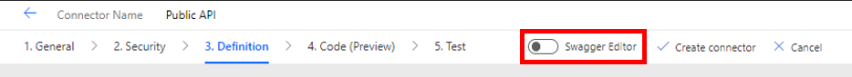

# Create Custom Endpoint using Azure Function

## Prerequisites

We encourage you to follow along the hands-on labs during lab sessions.

* If you don't have an Azure Subscription to use for these labs, please create a free subscription at https://azure.microsoft.com/free/.

## Lab

1.  Provision Azure Resources

    In this section you will Provision Azure resources that will host the API. 

    [](https://portal.azure.com/#create/Microsoft.Template/uri/https%3A%2F%2Fraw.githubusercontent.com%2Fmicrosoft%2Fpowerplatform-dev-day%2Fmain%2Ftemplates%2Fmain.json)

2. If you would like to update the location on where the resources are deployed the update the Location box with what ever region is the closes to you. For location options click [here](https://azure.microsoft.com/en-in/global-infrastructure/geographies/#geographies).

    

3. Click ***Review + Create***, then click ***Create***

4. When the deployment is complete. Navigate to the Resource Group.

    

5. Click the Function App.

    

6. On the left hand side, open the deployment center

    

7. Select ***External Git***

    

8. Enter the following information, then click ***Save***:

    * Repository: `https://github.com/ChrisMcKee1/ppdd-azure-function`
    * Branch: `main`

9. Open the logs for the deployment, Click ***Refresh***, Then click on the Commit ID.

    

10. The deployment will take some time to complete. But as long as it looks like this you are good to go to the next section.

    

# Create Custom Connector

## Prerequisites

We encourage you to follow along the hands-on labs during lab sessions.

* Request a power platform developer license [here](https://go.microsoft.com/fwlink/?LinkId=2180357&clcid=0x409).

## Lab

1. Click ***Sign In***

    
<!--  -->
2. Expand ***Data***, then click ***Custom Connectors***

    

3. Click ***New Custom Connector***

    

4. Click ***Import an OpenAPI from URL***

    

5. Enter URL: 

    ```
    https://raw.githubusercontent.com/ChrisMcKee1/ppdd-azure-function/main/swagger.json
    ``` 

    Then Click ***Import***  and click ***Continue***

    

6. You will need to get your Azure Function Base URL from Azure

    

7. Navigate to [Azure Portal](http://portal.azure.com/), then find your Function App

    

8. Click on the Function App

    

9. Copy the URL on the Function App

    

    *Note you do not need the `https://`*

    

10. Paste the base URL, then click ***Security***

    

11. No authentication is needed for this lab, so you can skip this by clicking ***Definition***

    

12. In this section you will see 3 Action in the purple box that were all imported. They will say Run, Run1, Run2. You will need to add a summary and update the ***Operation ID*** to a more friendly name. The ***Operation ID*** is the name of the method/function used in our custom connector. Reference the blue box to know what endpoint you are naming. Here is the list I used.

        1. Category
        2. Random-API
        3. List-API

    

    *Informational - All of this information can manually be set up. Since we are using the OpenAPI standard our swagger.json file can do most of the work for us.*

    - If you click on Random-API you will see under the request section that all of the url query parameter are list and you can edit them. This is the information that gets appended to the end of the url to filter the GET request. You can edit each parameter and the expected data types. 

         

    - Under the Response section you can add or edit the response options. 

        

    - Inside the response you can see the dynamic response properties that are expected with the type 200 response code. You can have different properties for different response. These body properties are based on a shared reference to a data model.

         

    - The location of the data model references can be found here. 

        

13. Open the ***Swagger Editor***

    

14. On line 2, edit the title property. This is the name of the initialized object used inside of Power Apps. Change the title to `PublicAPI` or `API`. 

    *What does this mean! Well lets compare this in code.*

    ```CSharp
    PublicAPI api = new PublicAPI();
    Category responseBody = api.Category();
    ```

    The class name `PublicAPI` is equal to the name of the connector. The name of the variable `api` is the same as the title properties in the swagger file. Also the actions can be thought of as methods. 

15. Click ***Create connector***

    

16. To test your new connector create a new connection

    

17. Now test your new connector

    

18. Now add it to Power Apps

    

@Team will need to show this in use in the same Power App used in the power apps demo. 