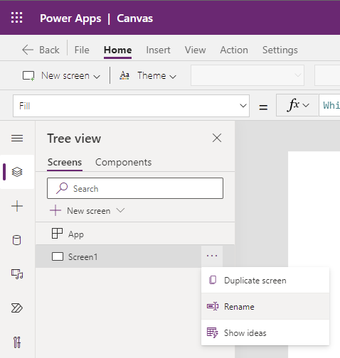

# Create Public API Power App

## Prerequisites

## Lab

## Create a new Power App

In this section you will create a Power App that will show lists of Public APIs.
    
1. Browse to https://make.powerapps.com
2. Click *Blank App*
3. Under *Blank Canvas App* click *Create*
4. Enter a name for the application
5. Click *Create*

* It is important to save a new Power App at least one time in order to take advantage of the auto-save feature.  If you do not save the app at least once, you risk losing all your work.

## Add Public API Connector

In this section, you will add the Public API custom connector to the Power App.
    
1. Click the database icon
2. Click *Add data*
3. In the Search blank, enter *Public* to search for the Public API connector you created.
4. Select the Public API connector to connect it to the Power App.
5. In the Tree View, rename Screen1 to *HomeScreen*

6. Click *Insert*
7. Click *Gallery*
8. Click *Blank vertical*
9. Rename the Gallery1 control to *gal_APIList*
10. In the *Tree View* delete both NextArrow1
11. In the *Tree View* select *App*
12. Select the *OnStart* property
13. In the function (fx) blank, enter *ClearCollect(apilist,PublicAPI.List().entries)*
14. Select the ellipsis to the right of *App* in the Tree View
15. Click *Run OnStart*
16. Click on the *gal_APIList* gallery to select it
17. Select *Data source* in the properties pane
18. Select the *apilist* collection as the gallery datasource
19. Change the Layout from *Blank* to "Title, subtitle, and body"
20. Click *Edit* to the right of *Fields* in the property pane
21. Change Subtitle3 to *Description*
22. Change Body3 to *Link*
23. In the Tree View, rename Title1 to *lbl_APIName*
24. In the Tree View, rename Subtitle1 to *lbl_Description*
25. In the Tree View, rename Body3 to *lbl_Link*
26. Select the *OnSelect* property of *lbl_Link*
27. In the fx (function) change Select(Parent) to Launch(ThisItem.Link)
28. Change lbl_Link to a blue font color
29. Add the Underline font property to lbl_Link
30. Click on the Play button to play the app
31. Test any API hyperlink by clicking on it.  A new browser window should open the hyperlink.

