# Create Public API Power App

## Prerequisites

* You will need to have a locally saved copy of the PublicAPI.xlsx for this lab.

## Lab

## Create a new Power App

In this section you will create a Power App that will show lists of Public APIs.
    
1. Browse to https://make.powerapps.com
2. Click ***Blank App***
3. Under ***Blank Canvas App*** click ***Create***
4. Enter a name for the application
5. Click ***Create***

* ***Note*** It is important to save a new Power App at least one time in order to take advantage of the auto-save feature.  If you do not save the app at least once, you risk losing all your work.

## Import Public API Datasource

In this section, you will add the Public API Excel datasource to the Power App
    
1. Click the ***data*** icon

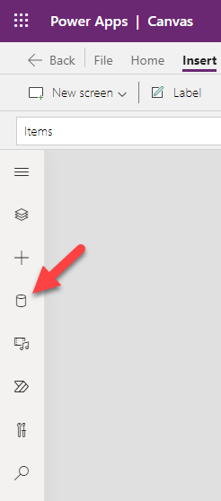

2. Click ***Add data***
3. In the Search blank, enter ***Excel*** and select ***Import from Excel***

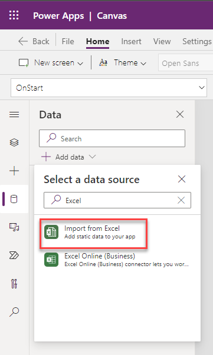

4. Browse to the PublicAPI.xlsx included in the solution
5. Select the table ***PublicAPIResponse*** when prompted and click ***Connect***

## Design a Power App

In this section, you will add and modify controls to make the Public API Power App

1. In the Tree View, rename Screen1 to ***HomeScreen***

2. Click ***Insert***
3. Click ***Gallery***
4. Click ***Blank vertical***

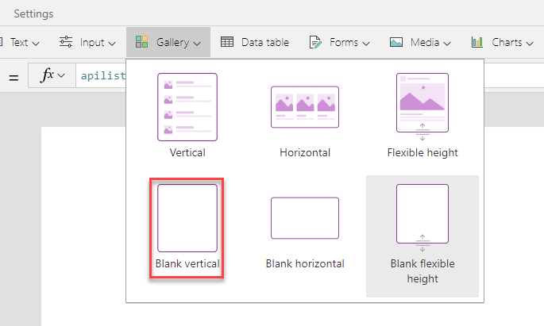

5. Rename the Gallery1 control to ***gal_APIList***

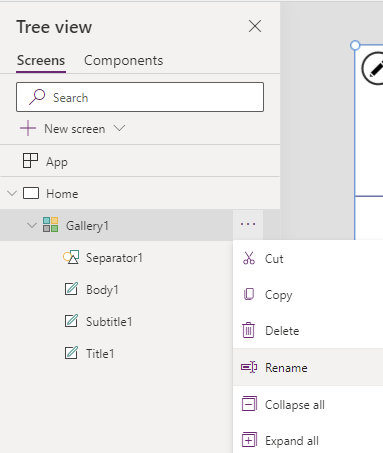

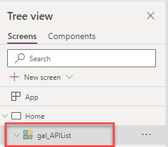

6. In the Tree View delete ***NextArrow1***
7. In the Tree View select ***App***
8. Select the ***OnStart*** property
9. In the function (fx) blank, enter ***ClearCollect(apilist,PublicAPIresponse.List().entries)***

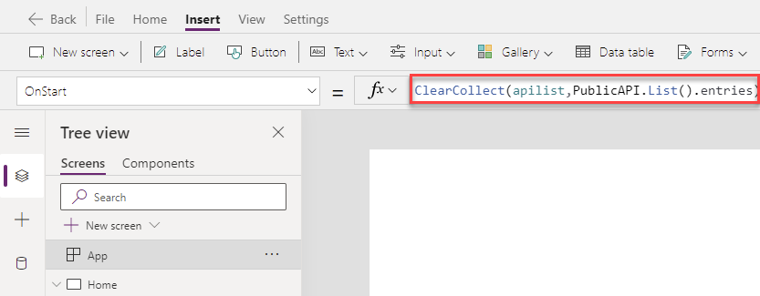

10. Select the ellipsis to the right of ***App*** in the Tree View
11. Click ***Run OnStart***

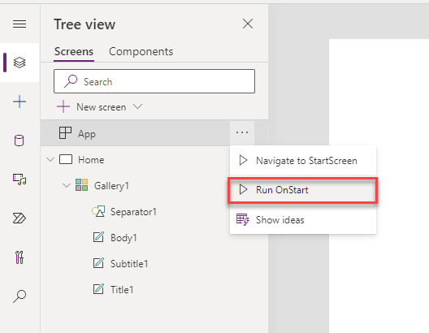

12. Click on the ***gal_APIList*** gallery to select it
13. Select ***Data source*** in the properties pane

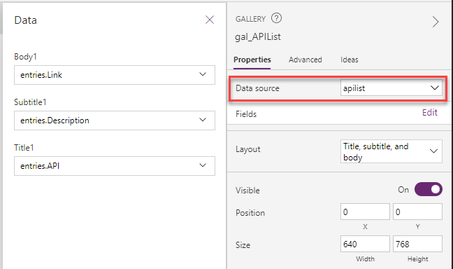

14. Select the ***apilist*** collection as the gallery datasource
15. Change the Layout from ***Blank*** to ***Title, subtitle, and body***

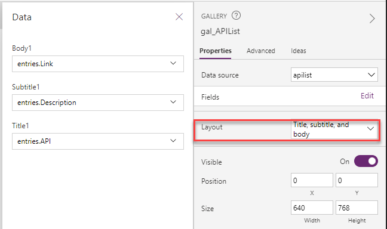

16. Click ***Edit*** to the right of ***Fields*** in the property pane

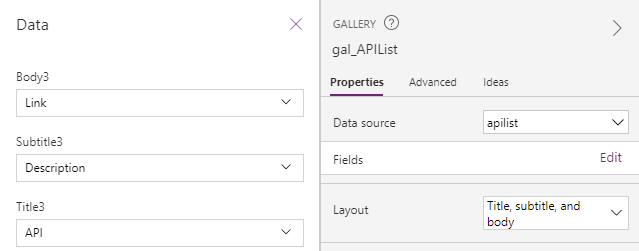

17. Change Subtitle1 to ***entries.Description***
18. Change Body1 to ***entries.Link***

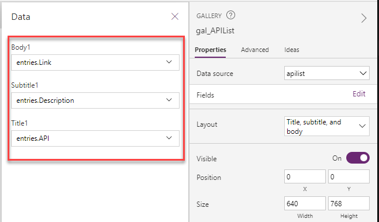

20. In the Tree View, rename Title1 to ***lbl_APIName***
21. In the Tree View, rename Subtitle1 to ***lbl_Description***
22. In the Tree View, rename Body1 to ***lbl_Link***

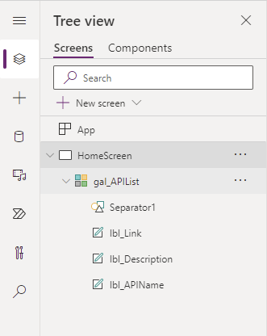

22. Select the ***OnSelect*** property of ***lbl_Link***
23. In the fx (function) change ***Select(Parent)*** to ***Launch(ThisItem.Link)***

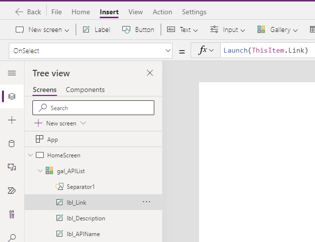

24. Change ***lbl_Link*** to a blue font color
25. Add the Underline font property to lbl_Link

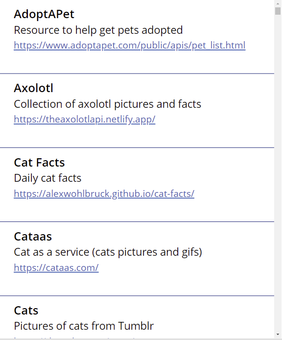

26. Click on ***gal_APIList*** to select it
27. Select the ***OnSelect*** property
28. In the fx (function) enter ***Set(SelectedAPI, ThisItem)***

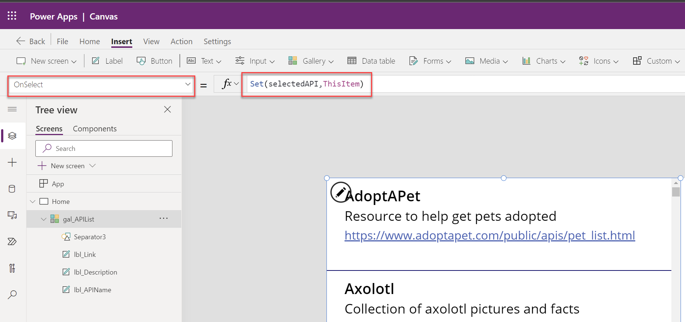

33. Click on the Play button to play the app
34. Test any API hyperlink by clicking on it.  A new browser window should open the hyperlink.

