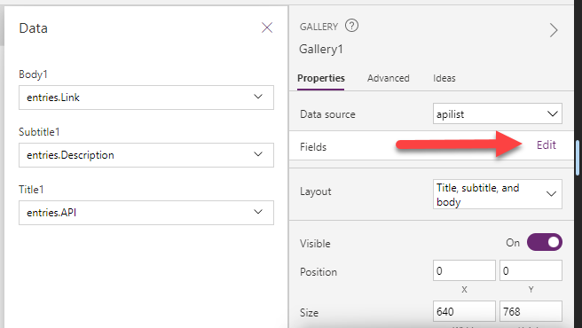

# Create Public API Power App

## Prerequisites

## Lab

## Create a new Power App

In this section you will create a Power App that will show lists of Public APIs.
    
1. Browse to https://make.powerapps.com
2. Click ***Blank App***
3. Under ***Blank Canvas App*** click ***Create***
4. Enter a name for the application
5. Click ***Create***

* ***Note*** It is important to save a new Power App at least one time in order to take advantage of the auto-save feature.  If you do not save the app at least once, you risk losing all your work.

## Add Public API Connector

In this section, you will add the Public API custom connector to the Power App.
    
1. Click the database icon
2. Click ***Add data***
3. In the Search blank, enter ***Public*** to search for the Public API connector you created.
4. Select the Public API connector to connect it to the Power App.
5. In the Tree View, rename Screen1 to ***HomeScreen***

6. Click ***Insert***
7. Click ***Gallery***
8. Click ***Blank vertical***
9. Rename the Gallery1 control to ***gal_APIList***

11. In the Tree View delete ***NextArrow1***
12. In the Tree View select ***App***
13. Select the ***OnStart*** property
14. In the function (fx) blank, enter ***ClearCollect(apilist,PublicAPI.List().entries)***

16. Select the ellipsis to the right of ***App*** in the Tree View
17. Click ***Run OnStart***

18. Click on the ***gal_APIList*** gallery to select it
19. Select ***Data source*** in the properties pane

20. Select the ***apilist*** collection as the gallery datasource
21. Change the Layout from ***Blank*** to ***Title, subtitle, and body***

21. Click ***Edit*** to the right of ***Fields*** in the property pane

22. Change Subtitle1 to ***Description***
23. Change Body1 to ***Link***
24. In the Tree View, rename Title1 to ***lbl_APIName***
25. In the Tree View, rename Subtitle1 to ***lbl_Description***
26. In the Tree View, rename Body1 to ***lbl_Link***
27. Select the ***OnSelect*** property of ***lbl_Link***
28. In the fx (function) change ***Select(Parent)*** to ***Launch(ThisItem.Link)***
29. Change ***lbl_Link*** to a blue font color
30. Add the Underline font property to lbl_Link

32. Click on the Play button to play the app
33. Test any API hyperlink by clicking on it.  A new browser window should open the hyperlink.

