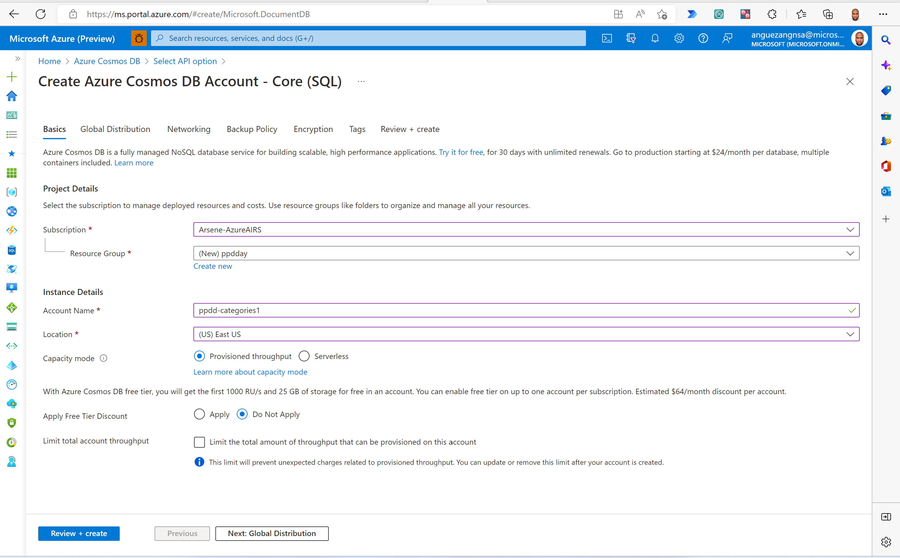

# Create Advanced Flows in Power Automate

## Prerequisites

We encourage you to follow along the hands-on labs during lab sessions.

* If you don't have an Azure Subscription to use for these labs, please create a free subscription at https://azure.microsoft.com/free/.
* Request a power platform developer license [here](https://go.microsoft.com/fwlink/?LinkId=2180357&clcid=0x409).
    * If that doesn't work, please try  [Microsoft 365 Developer Program](https://docs.microsoft.com/en-us/office/developer-program/microsoft-365-developer-program#join-the-microsoft-365-developer-program).
    
Part 1: Creating cosmos db
1.	Go to Home - Microsoft Azure
2.	Search for Azure Cosmos DB
3.	Select create

 

4.	Select Core(sql)

 
5.	Select your subscription then select or create your resource group. Input an  account name and select a location for your cosmosDB then click Review + Create then click create

 
 

6.	The deployment is now complete. (Takes 2 to 15 minutes)

 

7.	Go to resource. Then select Data Explorer and create a new container. Specify Database ID, Container id and  partition key. The rest of the parameters are left unchanged. Click OK .

 
 

8.	Go to keys and copy the primary key of your cosmos DB instance

 
 

More resources on how to create a cosmos db database creation here

Part 2: Creating the Dataverse table
1.	Go to https://make.preview.powerapps.com/
2.	Select Dataverse and click on Tables

 

3. 3.	Select New Table

 

