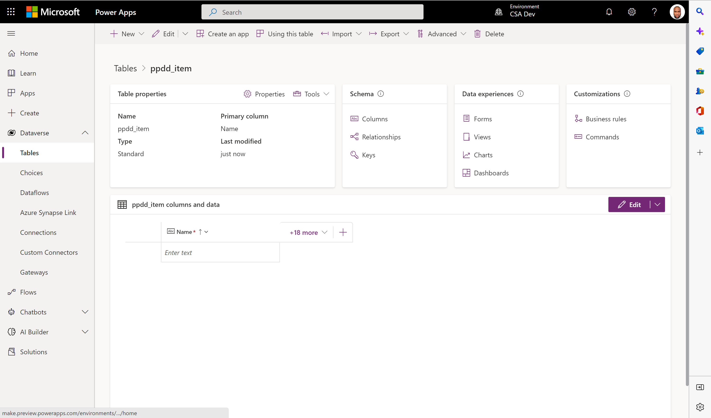
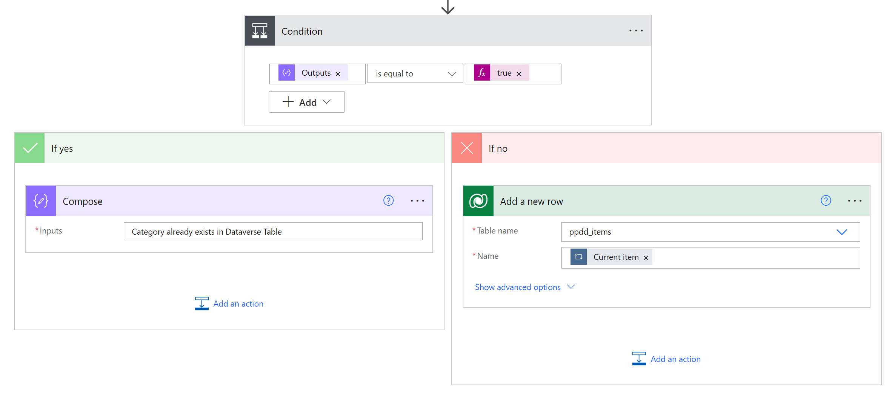
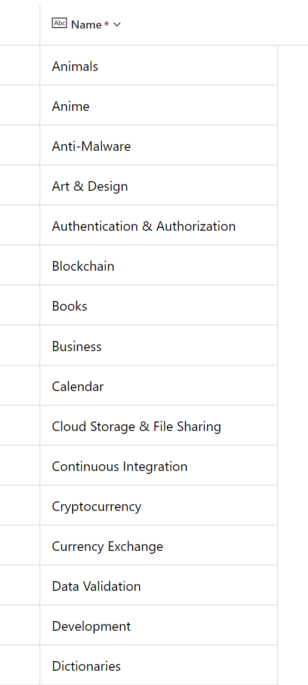

# Create Advanced Flows in Power Automate

## Prerequisites

We encourage you to follow along the hands-on labs during lab sessions.

* If you don't have an Azure Subscription to use for these labs, please create a free subscription at https://azure.microsoft.com/free/.
* Request a power platform developer license [here](https://go.microsoft.com/fwlink/?LinkId=2180357&clcid=0x409).
    * If that doesn't work, please try  [Microsoft 365 Developer Program](https://docs.microsoft.com/en-us/office/developer-program/microsoft-365-developer-program#join-the-microsoft-365-developer-program).

## Objective
The goal of this lab is to build a flow in Power Automate that pulls data from an API endpoint in JSON format, peform operation on this data and then load this into a CosmosDB table and Dataverse table. At the end of the lab, we would had learned about important concepts in power Automate like looping, JSON manipulation, API calling and Dataverse integration into Power Automate.
    
## Part 1: Creating cosmos db
In the first part of the lab, we will create a Cosmos db table in the Azure cloud. 
1.	Go to [Home - Microsoft Azure](portal.azure.com)
2.	Search for Azure Cosmos DB
3.	Select create

 

4.	Select Core(sql)

 
5.	Select your subscription then select or create your resource group. Input an  account name and select a location for your cosmosDB then click Review + Create then click create

 
 

6.	The deployment is now complete. (Takes 2 to 15 minutes)

 

7.	Go to resource. Then select Data Explorer and create a new container. Specify Database ID, Container id and  partition key. The rest of the parameters are left unchanged. Click OK .

 
 

8.	Go to keys and copy the primary key of your cosmos DB instance

 
 

More resources on how to create a cosmos db database creation [here](https://docs.microsoft.com/en-us/azure/cosmos-db/sql/create-cosmosdb-resources-portal)

## Part 2: Creating the Dataverse table
In the second  part of the lab, we will create a Dataverse table in Microsft Dataverse. 
1.	Go to [powerapps] (https://make.preview.powerapps.com/)
2.	Select Dataverse and click on Tables

 

3.Select New Table

 

4. Specify the display name, the plural name will be automatically filled. Description is optional

 

5. Your new table has been created as shown below

 

More information about creating tables in Dataverse [here](https://docs.microsoft.com/en-us/learn/modules/get-started-with-powerapps-common-data-service/)

## Part 3: Creating the flow in Power automate
In part 3, we are creating the flow that calls an API endpoint to retrieve Data in JSON format then loads this into a cosmos db table and Dataverse table.

1. Go to [power automate](https://make.preview.powerautomate.com/)

 

2. Select *Create* then click on **Automated cloud flow**
3.	Specify the flow name then click on skip

 

4.	In the initial step. Search for **http** and click on it

 

5.	Specify the Method **(GET)** and URI

***URI = https://powerplatformdevday.azurewebsites.net/api/GetAPICategory?clientId=apim-ppdevday***

 

6.	Add a new step, **Parse JSON**. That parses the JSON object returned by the GET method in the http step above.
Content = body (from dynamic content)
Schema click on “Generate from sample” then  copy and paste the URI in a browser and copy the JSON object returned

 

Your flow should look like this at this stage

 

7.	Save your flow by clicking Save then click on **Test** to test the flow. Select manually then click Test.

 

8.	The flow ran successfully and was able to retrieve the _categories_ information in JSON format from the API

 

9.	Click on edit then Add a new step to initialize an Array variable that stores the retrieved category data.

 

Specify the name of the variable **(categoryItem)** and the type (Array) as shown below


 

10. We will now list the rows in the dataverse table. Add a new step, **List Rows** for Dataverse and pass it the table name.


11. Add a new step **(Apply to Each)** in which we will add the category items to the categoryItem array variable. Name this step _Adding categories to Array variable_
**Name: categoryItem (the array variable)
value: Name (generated from the dynamic content)
 


12. We will now loop over the Array (categoryItem) and insert items within into the cosmosDb container (table) and dataverse table we earlier created.
We will do this in multple steps
 i. Add an Apply to each step and within this,  add a new step to **create or update document (V3)** for cosmos db.
 
 
 
 You will need to provide the connection details
 Click on the 3 dots at the right hand corner of the step and select Add a new connection
*Note: CosmosDB upserts by default*

 .
- Authentication Type: **Access key
- Account ID: The name of your database without the document.azure.com
- Access key: paste the access key you earlier copied in step 1

*This will add a new connection and allow you to connect to the cosmos db table as shown below*
.

In the body, paste the following
```
{
  "id": Current Item 
}
```

*Get the current Item from the dynamic content as you did in step 12


The output from the previous step is **Categories** and is gotten from the dynamic content. The loop should look like this

 

 ii. Add a new **compose**  step within the loop. Compose Constructs an arbitary object from the action's inputs. Rename the compose to
 **Does Category exists in the Dataverse table**
 We will write a function for the inputs to the compose
 inputs: **contains(variables('categoryItem'),items('Apply_to_each'))**
 Get the contains function from the expression tab, pass the variable categoryItem from the dynamic content. click on update after writing the function 
 This formula checks to see if the items in the categoryItem array exist in the dataverse table (ppdd_items)
 
  
 
 iii. The next step is to add a **condition** such that if the output from the previouss step (Does Category exists in the Dataverse table) is true for an item, we skip that item thus the "if yes" step of the condition will be applied. If the result is false, then we add the item to the Dataverse table by executing the "if No". The goal is to avoid inserting duplicates in the dataverse table.
 
  The condition
  
  
  
  The if yes
  
  
   if no
   
   
   putting all together
    
 
13. We add another step, **Terminate** . The Terminate control in Microsoft Power Automate simply ends the execution of a flow


14. Save the flow. It should now look like this. With your flow being ready for testing


15.Now let’s test the flow. Click on Test and Select Manually then click Test


The flow ran successfully and inserted data in both cosmos db and dataverse as shown below


**Cosmos db (ppdd-categories1) table


**Dataverse (ppdd-items) table




