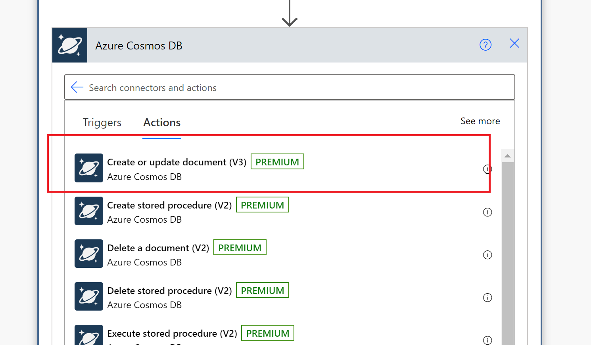

# Create Advanced Flows in Power Automate

## Prerequisites

We encourage you to follow along the hands-on labs during lab sessions.

* If you don't have an Azure Subscription to use for these labs, please create a free subscription at https://azure.microsoft.com/free/.
* Request a power platform developer license [here](https://go.microsoft.com/fwlink/?LinkId=2180357&clcid=0x409).
    * If that doesn't work, please try  [Microsoft 365 Developer Program](https://docs.microsoft.com/en-us/office/developer-program/microsoft-365-developer-program#join-the-microsoft-365-developer-program).
    
## Part 1: Creating cosmos db
1.	Go to [Home - Microsoft Azure](portal.azure.com)
2.	Search for Azure Cosmos DB
3.	Select create

 

4.	Select Core(sql)

 
5.	Select your subscription then select or create your resource group. Input an  account name and select a location for your cosmosDB then click Review + Create then click create

 
 

6.	The deployment is now complete. (Takes 2 to 15 minutes)

 

7.	Go to resource. Then select Data Explorer and create a new container. Specify Database ID, Container id and  partition key. The rest of the parameters are left unchanged. Click OK .

 
 

8.	Go to keys and copy the primary key of your cosmos DB instance

 
 

More resources on how to create a cosmos db database creation [here](https://docs.microsoft.com/en-us/azure/cosmos-db/sql/create-cosmosdb-resources-portal)

## Part 2: Creating the Dataverse table
1.	Go to [powerapps] (https://make.preview.powerapps.com/)
2.	Select Dataverse and click on Tables

 

3.Select New Table

 

4. Specify the display name, the plural name will be automatically filled. Description is optional

 

5. Your new table has been created as shown below

 

More information about creating tables in Dataverse [here](https://docs.microsoft.com/en-us/learn/modules/get-started-with-powerapps-common-data-service/)

## Part 3: Creating the flow in Power automate
1. Go to [power automate](https://make.preview.powerautomate.com/)

 

2. Select *Create* then click on Automated cloud flow
3.	Specify the flow name then click on skip

 

4.	In the initial step. Search for http and click on it

 

5.	Specify the Method (GET) and URI

URI = https://powerplatformdevday.azurewebsites.net/api/GetAPICategory?clientId=apim-ppdevday

 

6.	Add a new step. Parse JSON. That parses the JSON object returned by the GET method in the http step above.
Content = body (from dynamic content)
Schema click on “Generate from sample” then  copy and paste the URI in a browser and copy the JSON object returned

 

Your flow should look like this at this stage

 

7.	Save your flow by clicking Save then click on Test to test the flow. Select manually then click Test.

 

8.	The flow ran successfully and was able to retrieve the categories from the API

 

9.	Click on edit then Add a new step to store the retrieved categories in a variable

 

Specify the name of the variable (insertedRecords) and the type (Array) as shown below

 

10.	We will now loop over the Array (insertedRecords) and insert items within into the cosmosDb container (table) and dataverse table we earlier created. To loop over the items, we add a new step and search for apply to each

 

The output from the previous step is Categories and is gotten from the dynamic content

 

11. Add a “Add a new row” into dataverse action inside the apply to each. 
 

12.	The Table Name is the name of the table you created in step 2 and Name will be “current value” gotten from the dynamic content
 
13.	Add a new action in the apply to each loop. To create or update a document in cosmos db

14.	Click on the 3 dots at the right hand corner of the step and select Add a new connection
               .
- Authentication Type: Access key
- Account ID: The name of your database without the document.azure.com
- Access key: paste the access key you earlier copied in step 1
*This will add a new connection and allow you to connect to the cosmos db table as shown below*
.

In the body, paste the following

*{
  "id": Current Item 
}*
*Get the current Item from the dynamic content as you did in step 12*

15. Save the flow. It should now look like this. With your flow being ready for testing

16.	Now let’s test the flow. Click on Test and Select Manually then click Test

The flow ran successfully and inserted data in both cosmos db and dataverse as shown below

Cosmos db output

Dataverse output

